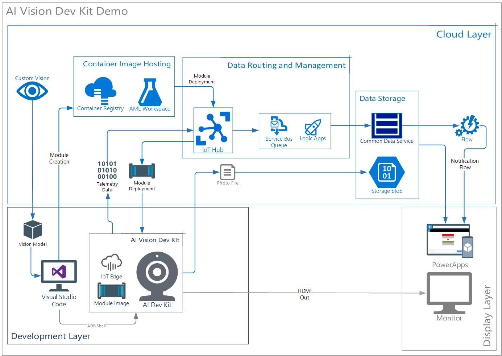

# Using Vision AI Dev Kit to build an Edge Computing Demo

This is a sample showing how to use Azure Machine Learning SDK and Azure IoT Edge to convert a model, build a container image, and deploy a model image to Vision AI Developer Kit in Visual Studio Code.

## Introduction

The Vision AI Dev Kit is a camera developed by Qualcomm which includes its proprietary Neural Processing Engine, the Snapdragon Neural Processing Engine (SNPE). It allows users to develop and showcase use-cases for IOT Edge solutions which are integral in environments or situations which require:

1. 	Quick response time and low latency
2.	High volumes of network traffic and cloud processing
3. 	High resilience despite low internet connectivity

This guide will teach you how to setup a demo which features:

### 1.  Workplace Safety AI

This demo imagines a workspace environment where a workspace is monitored by AI Cameras to detect safety violations. When a user is caught entering the work-zone without a helmet, the camera detects it, his picture is taken, and a notification is sent to a supervisor.

* 	Data and AI

    This demo demonstrates the camera’s AI inferencing capabilities. It can be used as a tool to drive conversations surrounding AI, and the real-world value it can provide. It also demonstrates the feasibility of video analytics as a solution in areas with low connectivity, or as a measure to reduce bandwidth usage.
* 	Power Platform

    This demo can also be used to show the ease of use of PowerApps to build front-end applications and interfaces from existing data (using data collected from the camera stored in the CDS entity). 

### 2. 	“Plug and Play” Module switching
This demo shows the capabilities of IOT Hub in the management and deployment of modules to Edge devices, addressing concerns with the scalability of Edge solutions. Clients will be able to see a visual representation of how a module is deployed at scale to several devices via the azure portal.  

# Implementation Details:
See the [Setup Guide and Documentation]("Documentation.docx") for step by step implementation guide

